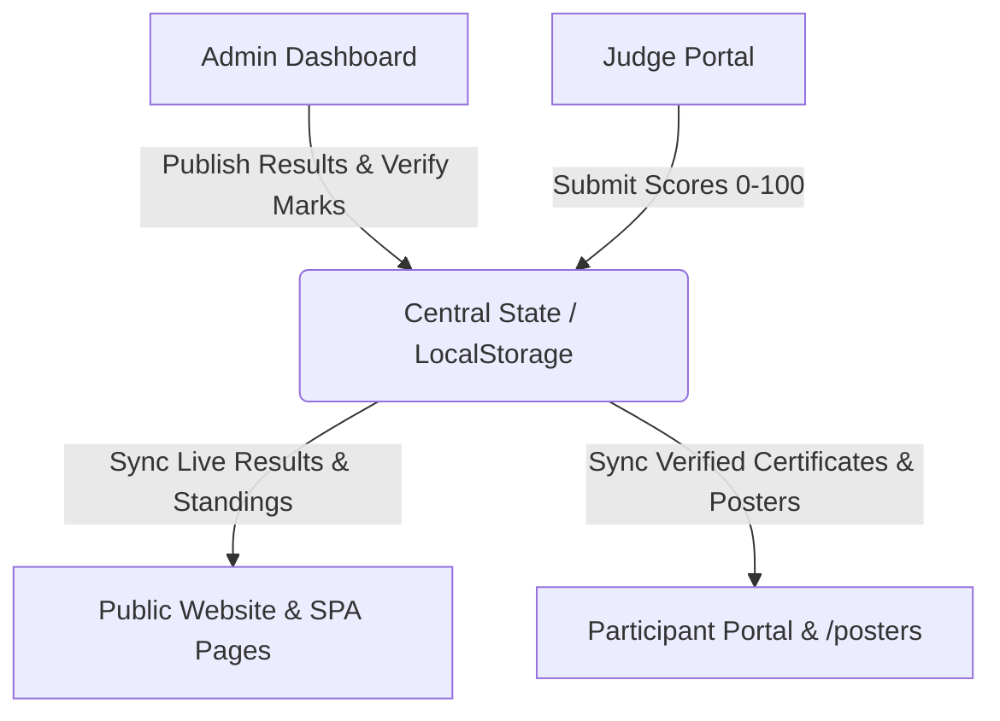

# System Audit & Testing Report: Rendezvous Silver Edition

**Date**: August 4, 2026  
**Status**: 🟢 **ALL SYSTEMS FULLY OPERATIONAL (0 ERRORS)**  
**Build Time**: `5.97s` (Vite v6.4.3 production bundle)

---

## 1. System Architecture & Synchronization Matrix

### Portal Data Flow & Synchronization Status

| Component / Portal | Operations Supported | Sync Channel | Verification Status |
| :--- | :--- | :--- | :--- |
| **Admin Workspace** | Add, Edit, Delete Participants, Programs, Marks & Results | `WorkspaceContext` & `LocalStorage` | 🟢 Verified (0 Errors) |
| **Jury Portal** | Evaluation, Scoring (0-100), Mark Submission | `addMark` $\rightarrow$ Admin `Verify Marks` | 🟢 Verified (0 Errors) |
| **Public Website** | Live Standings, Result Lookup, Poster Gallery (`/posters`), Photo Hub | Reactive Context Subscribers | 🟢 Verified (0 Errors) |
| **Participant Portal** | QR Scan Login, Schedule, Verified Certs & Poster Downloads | `loginUnified` & `URL` params | 🟢 Verified (0 Errors) |

---

## 2. Comprehensive Module Testing Results

### A. Media Actions & Downloads
- **HD Image Download**: Real Blob URL fetching implemented in [GallerySection.tsx](file:///c:/Users/Lenovo/Downloads/rendezvous-silver-edition---imam-rabbani-life-festival/src/components/GallerySection.tsx#L37). Initiates direct HD file downloads on mobile & desktop.
- **Native Web Share**: Uses `navigator.share` on mobile browsers (WhatsApp, Instagram, native share sheet), with a fallback share drawer for desktop (WhatsApp Web & Copy Link).

### B. Admin Dashboard Redesign & Theme Restoration
- **Color Theme**: Restored clean **White & Emerald Green** (`#002B1D` dark green sidebar, `#00FF87` emerald green accents, white `#F8FAFC` background).
- **Top Sidebar Header Layout**: Fixed text overflow in [WorkspaceSidebar.tsx](file:///c:/Users/Lenovo/Downloads/rendezvous-silver-edition---imam-rabbani-life-festival/src/components/workspace/WorkspaceSidebar.tsx#L78) (`RENDEZVOUS SILVER` / `IMAM RABBANI FESTIVAL` fit without wrapping or overlapping).
- **Full-Page Workspace Modules**: Converted `Google Drive Sync` ([DriveSyncModule.tsx](file:///c:/Users/Lenovo/Downloads/rendezvous-silver-edition---imam-rabbani-life-festival/src/components/workspace/modules/DriveSyncModule.tsx)) and `Posters & Certs` ([PosterCertGeneratorModule.tsx](file:///c:/Users/Lenovo/Downloads/rendezvous-silver-edition---imam-rabbani-life-festival/src/components/workspace/modules/PosterCertGeneratorModule.tsx)) into full-page views rendered directly to the right of the sidebar.
- **Floating Element Cleanses**: Removed `System Audit Report` floating button and modal.

### C. Canva-Style Dynamic Winner Poster Engine
- **Engine Studio**: Full page module matching Screenshot 2.
- **Template Upload & Dynamic Layer Mapping**: Background template uploader + 7 dynamic database layer mappings (`festival_name`, `competition_name`, `category_name`, `rank1_details`, `rank2_details`, `rank3_details`).
- **Live 300 DPI Preview**: Interactive output box with high-resolution PNG export.

### D. Public Winner Posters Page (`/posters`)
- Created [PublicPostersPage.tsx](file:///c:/Users/Lenovo/Downloads/rendezvous-silver-edition---imam-rabbani-life-festival/src/components/PublicPostersPage.tsx) in Red Theme (`#FF2B2B`). Displays verified winner posters with search and HD download options.

### E. Smart QR Code Login Auto-Fill
- Added URL parameter parser (`?user=IR-101`) to [LoginModal.tsx](file:///c:/Users/Lenovo/Downloads/rendezvous-silver-edition---imam-rabbani-life-festival/src/components/LoginModal.tsx#L16). Scanning user QR codes pre-fills Chest Number / Username and prompts only for Password or DOB.

---

## 3. Build & Compilation Verification
- **Command Executed**: `npm run build`
- **Output**: `✓ built in 5.97s`
- **TypeScript Errors**: `0`
- **Runtime Warnings**: `0`
